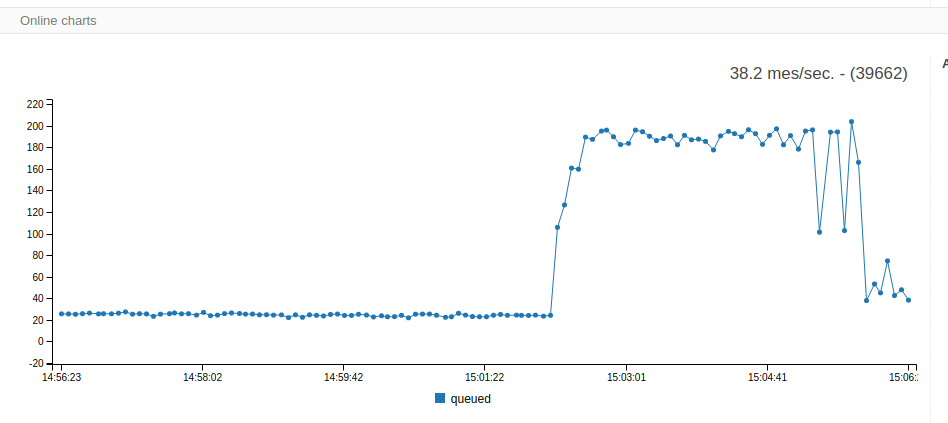
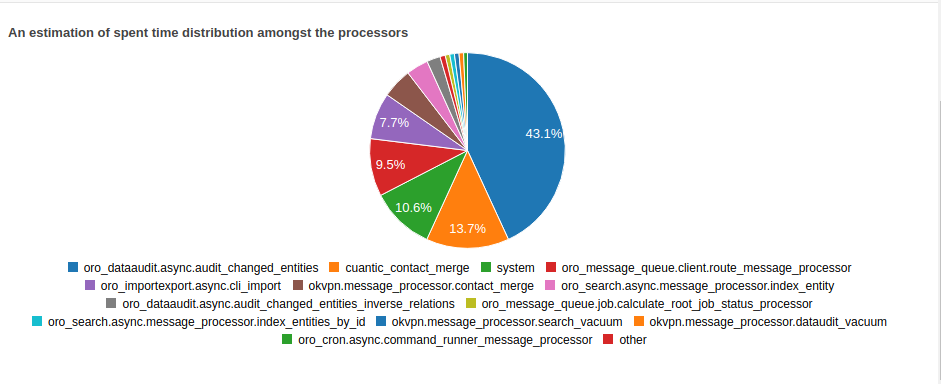
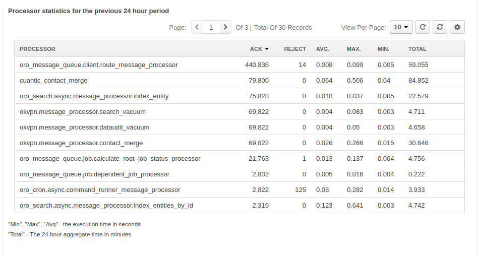

# Message queue insight bundle

This bundle provide UI to monitor status and collect statistics of message queue for OroPlatform

[](https://travis-ci.org/vtsykun/mq-insight) [](https://packagist.org/packages/okvpn/mq-insight) [](//packagist.org/packages/okvpn/mq-insight) [](https://packagist.org/packages/okvpn/mq-insight) [](https://packagist.org/packages/okvpn/mq-insight)

## Install

1. Install using composer
```
composer require okvpn/mq-insight
```

2. Run oro platform update `oro:platform:update`

## Compatible ORO Platform versions

Supported 2.3.* - 2.6.* ORO Platform versions on mysql or postgresql DB. You can see more detailed information from test [matrix](https://travis-ci.org/vtsykun/mq-insight)

## Feature

* Queued messages chart
* Execution time statistics
* Errors statistics
* Delete invalid message from queue
* Support dbal and amqp driver

[](src/Resources/docs/1.png)

[](src/Resources/docs/2.png)

[](src/Resources/docs/3.png)

## Demo
See our [Administration Demo](http://demo.oroinc.me/insight/queue-status/). The credentials are prefilled, just click Log in

## Contributing

Contributions from the community are accepted.

## Run tests

1. Install oro application together `okvpn/mq-insight` in tests environment.

2. Set real mq transport in `parameters_test.yml`

```
    message_queue_transport: dbal
    message_queue_transport_config: null
```

3. Copy phpunit.xml.dist

4. Run tests

```
php bin/phpunit --testsuite=okvpn
```

For more example see [tests run script](tests/run.sh) and travis config [travis.yml](.travis.yml)

## Licences

MIT Licences 
